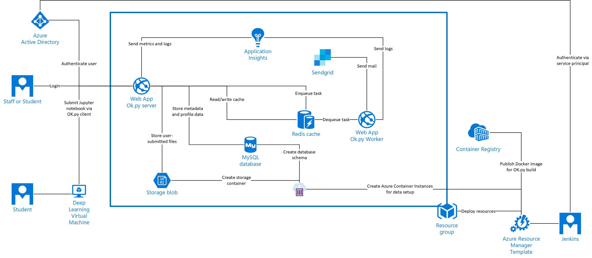

# Deploy to Azure PaaS

These templates deploy [Ok.py](www.okpy.org) to Azure. In a production environment you may wish to customize these templates to share resources between environments and to adjust resource sizing. For example you may wish to use a single mySQL server with multiple databases, rather than one server per environment.

## Architecture

The provided templates deploy everything within the Resource Group outlined below. Items outside the resource group are an indication as to how Ok.py can integrate with additional Azure services:



## Accept SendGrid Terms and Conditions

Prior to deploying the template the terms and conditions for SendGrid must be accepted.

Using PowerShell:

```
Get-AzureRmMarketplaceTerms -Publisher "sendgrid" -Product "sendgrid_azure" -Name "free" | Set-AzureRmMarketplaceTerms -Accept
```

If you do not have access to PowerShell this can be run in the cloud shell via the Azure Portal.

To deploy [Ok.py](www.okpy.org) to Azure use the deploy button below. If you are not familiar with the configuration of Azure resources please check our [integration guide](../).

<a href="https://portal.azure.com/#create/Microsoft.Template/uri/https%3A%2F%2Fraw.githubusercontent.com%2Ficokpy%2Fok%2Fenhancement%2Ficokpy%2Fazure-templates%2Fazure%2Fpaas%2Fazure.deploy.json" target="_blank">
    
</a>
